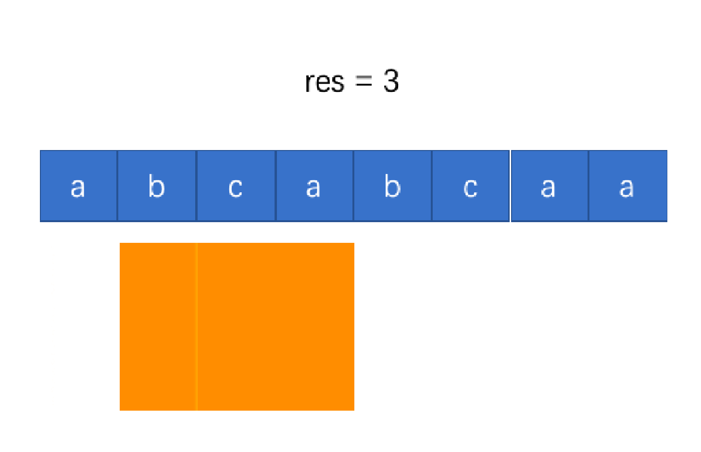
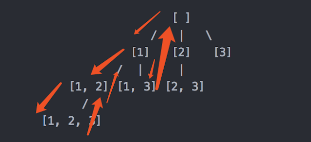
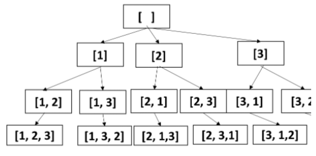

## Must Knows
Time Complexities
```
binary search - O(log n)
quicksort time - O(nlogn)

heap add/remove - O(log n)
heap lookup minimum - O(1)
convert list to heap - O(n)
convert array to heap - O(nlogn)
```
Code Snippets
```python
## Strings
ord() # char -> ascii number
chr() # ascii number -> char
count = [0]*26;    index = ord(<letter>) - ord('a') # used for counting letters

## Matrices
matrix = [[0]*cols for i in range(rows)]  # matrix initialization

## Counter
map = collections.Counter(nums) # =k: val, v: count
```

<table>
<tr> 
<th> linked list</th>
<th> graph (adj)</th>
<th> heap</th>
</tr>
<tr>
<td>

```python
def ListNode(val: int):
    def __init__(self, val, next=None):
        self.val = val
        self.next = next
```

</td>
<td>

```python
adj = {}                            
for i in range(n):
    adj[i] = []
for edge in edges:
    if not adj.get(edge[0]):
        adj[edge[0]] = []
    if not adj.get(edge[1]):
        adj[edge[1]] = []
    adj[edge[0]].append(edge[1])
    adj[edge[1]].append(edge[0])
```

</td>
<td>

```python
heapq.heappush(nums, value)  # Push to heap
heapq.heappop(nums) # Pop and returns min heap
heapq.heapify(nums) # List -> min heap
nums[0] # peek min heap

# Top K Most Frequent (Least - min_heap: +value)
max_heap = [(-value, key) for key, value in map.items()] 
# Max heap uses negative nums (min_heap: +nums)
max_heap = [x*-1 for x in nums]
```

</td>
</tr>
</table>


<table>
<tr> 
<th> tree</th>
<th> graph</th>
<th> trie</th>
</tr>
<tr>
<td>

```python
def TreeNode(val: int):
    def __init__(self, val, 
            left=None, right=None):
        self.val = val
        self.left = left
        self.right = right
```

</td>
<td>

```python
def GraphNode(val: int, neighbors: List[int]):    
    def __init__(self, val=0, neighbors):
        self.val = val
        self.neighbors = neighbors
```

</td>
<td>

```python
import collections
class TrieNode:
    def __init__(self):
        self.children = defaultdict(TrieNode)
        self.is_word = False
```

</td>
</tr>
</table>

## Array
### sliding window
<table>
<tr> 
</tr>
<tr>
<td>

```python
# Length of longest substring without repeating characters
def findLengthOfLongestSubstring(s: str) -> int:  # Sliding window                                                                          
    result = 0
    unique_letters = set()

    # Use a set to determine if we got duplicates
    left = 0
    for right in range(len(s)):

        # When condition is met (right finds duplicate),
        # Continuously move left pointer and remove from set.
        # The while loop will break once the repeated character is removed.
        while s[right] in unique_letters:
            unique_letters.remove(s[left])
            left += 1

        # Keep adding character to set to find repeats
        unique_letters.add(s[right])

        # Update max.
        result = max(result, right - left + 1)

    return result
```

</td>
<td>



</td>
</tr>
</table>

### binary search
Binary search is an algorithm that only works on a <b>sorted</b> array. O(log n) time.
<table>
<tr> 
</tr>
<tr>
<td>

```python
left, right = 0, len(nums) - 1
while left <= right:
    # Update mid pointer (cast to int - this will floor floats)                  
    mid = int(left + (right - left) / 2)

    # Closure condition
    if nums[mid] == x:
        return True

    # Condition to update left or right pointer.
    elif x < nums[mid]:
        right = mid - 1
    else:
        left = mid + 1
return False
```

</td>
<td>


</td>
</tr>
</table>


## Backtracking - Arrays / Matrices
For array type backtracking problems, use DFS.
<table>
<tr> 
</tr>
<tr>
<td>

### DFS - Subsets (Arrays)
```python
def subsets(self, nums):
    def backtracking(index, subset):
        # Return when end is reached
        if index == len(nums):
            result.append(subset)
            return

        # Subsets takes every combination
        result.append(subset)

        # Traverse from current index to len(nums)
        for i in range(index, len(nums)):
            backtracking(i + 1, subset + [nums[i]])

    result = []
    backtracking(0, [])
    return result
```

</td>
<td>



</td>
</tr>
</table>


<table>
<tr> 
</tr>
<tr>
<td>

### DFS - Permutations (Array)
```python
def permutations(self, nums):
    def backtracking(index, visited, permutation):
        # Return when end is reached
        # Permutation is the length of nums
        if len(permutation) == len(nums):
            result.append(permutation)
            return
        
        # Traverse all indices to get all permutations
        for i in range(len(nums)):
            # If next neighbor is visited, skip
            if nums[i] not in visited:
                backtracking(index + 1, visited + [nums[i]], permutation + [nums[i]])
            
    result = []
    backtracking(0, [], [])
    return result
```

</td>
<td>



</td>
</tr>
</table>


### DFS / BFS - Matrix
For matrix type backtracking problems, use DFS or BFS. Preferably DFS (easier), but BFS for shortest path.
<table>
<tr> 
<th> dfs</th>
<th> bfs</th>
</tr>
<tr>
<td>

```python
def dfs(matrix, i, j):
    # Constraints: Out of bounds
    if i < 0 or j < 0 or i >= len(matrix) or j >= len(matrix[0]):
        return

    # Constraint: Visited set
    if (i, j) in visited:
        return

    # Process: Add to Visited
    visited.add((i, j))

    # Traverse 4-ways
    dfs(matrix, i + 1, j)
    dfs(matrix, i - 1, j)
    dfs(matrix, i, j + 1)
    dfs(matrix, i, j - 1)
```

</td>
<td>

```python
def bfs(visited, matrix: List[List[int]], i, j):
    # Queue will consist of INDICES. Not element values.
    queue = deque()
    queue.append([i, j])

    # Indice movement for neighbors: Down, Up, Right, Left
    directions = [[1, 0], [-1, 0], [0, 1], [0, -1]]

    # Perform BFS. The trick is to use the directions (left, right, up, down) to iterate through the neighbors.
    # Figure out your constraints (out of bounds, gates, shortest path). Then process element
    while queue:
        curr = queue.popleft()

        # Grab current row and col indices
        c_i = curr[0]
        c_j = curr[1]

        # Traverse neighboring elements
        for direction in directions:
            # Update current indices with direction you are going
            i = c_i + direction[0]
            j = c_j + direction[1]

            # Constraints: (1) Out of bounds, (2) Value == 0 or Visited
            if i < 0 or j < 0 or i >= len(matrix) or j >= len(matrix[0]) or matrix[i][j] == "0" or (i, j) in visited:
                continue

            # Process - add to visited
            visited.add((i, j))

            # Add neighbor to queue
            queue.append([i, j])
```
</td>
</tr>
</table>

## Graph
See top for Graph code. Can be structured as (1) Adjacency List, (2) Graph Node.
### DFS / BFS - Graph
<table>
<tr> 
<th> dfs</th>
<th> bfs</th>
<th> bfs visited</th>
</tr>
<tr>
<td>

```python
def dfs(node):
    # Constraint: Visited
    if node in visited:
        return

    # Do something - Add to visited
    visited.add(node)
    print(node.val, end=" ")

    # Traverse neighbors
    for nei in node.neighbors:
        dfs(nei)
```

</td>
<td>

```python
def bfs_graph(root: Node):
   queue = deque([root])

   while queue:
       for _ in range(len(queue)):
           curr = queue.popleft()
           
           print(curr.val, end=" ")

           # Append neighbors to queue (instead of children in a tree)
           for nei in curr.neighbors:
               queue.append(nei)
```

</td>
<td>

```python
def bfs(root: Node):
   queue = deque([root])
   visited = set(root)

   while queue:
       for _ in range(len(queue)):
           curr = queue.popleft()

           print(curr.val, end=" ")

           for nei in curr.neighbors:
              
               # Constraint - Visited, skip, prevents infinite loop on cycles.
               if nei in visited:
                   continue
              
               # Process - Add neighbor to visited   
               visited.add(nei)
              
               queue.append(nei)
```

</td>
</tr>
</table>

### Cyclic Detection (DFS)
<table>
<tr> 
<th>Directed</th>
<th>Undirected</th>
</tr>
<tr>
<td>

Use a visitor array with values of (0 = Unvisited, 1 = Visited, -1 = Visiting). We first set to -1 "visiting", then once we reach max-depth, backtrack and set to 1 "visited". In the same traversal, we encounter 1 "visited", a cycle is detected.
```python
# [Course Schedule]
def dfs_detect_cycle_directed(current):
    # already visited at 1 
    if visited[current] == 1:
        return True

    # detect cycle at -1
    if visited[current] == -1:
        return False
    
    # set unvisited 0 to visiting -1
    visited[current] = -1
    
    # traverse neighbors, return false for cycle detection
    for neighbor in adj.get(current):
        if not dfs(neighbor):
            return False
    
    visited[current] = 1  # visited
    return True
```

</td>
<td>

Use a simple visitor list (set/array). Recursive equation will not only need current node, but also parent node. Parent node should be skipped when traversing neighbors, and updated when going deeper. If other neighbors are visited during traversal, a cycle is detected.
```python
# [Graph Valid Trees]
def dfs_detect_cycle_undirected(current):
    # if visited - return; otherwise - add to visited
    if current in visited:
        return
    visited.add(current)

    for nei in adj.get(current):
        # skip parent
        if nei == parent:
            continue

        # if visited, cycle detected
        if nei in visited:
            return False

        # return False for cycle detection
        if not dfs(nei, node):
            return False
    return True
```

</td>
</tr>
</table>

### Bipartite Graph (DFS)
Keep track of whether or not the node has been visited with an array. The array contains three numbers: (0 = Unvisited, 1 = Group A, -1 = Group B). Once the entire graph has been visited or if two nodes of the same group are next to each other, the recursion ends. This algorithm will not work for cycles, because we can have an even number of nodes that are cyclic that could be a bipartite graph.
```python
# [Possible Bipartition]
def dfs_bipartite(current, previous_visited_value):            
    # Before returning on visited,
    # Check if current and previous are same type. If so, not a bipartite graph!
    if previous_visited_value == visited[current - 1]:
        return False
    
    # If visited, return
    if visited[current - 1] != 0:
        return True            

    # If previous visited is 1, then we switch current visited to -1
    if previous_visited_value == 1:
        visited[current - 1] = -1
    else:
        visited[current - 1] = 1
    
    for nei in adj.get(current):
        # Update previous visited value
        previous_visited_value = visited[current - 1]
        if not dfs(nei, previous_visited_value):
            return False
    return True
```

### Topological Sort (DFS)
Topological sorted result is a collection of nodes leaf-first. This only valid in acyclic graphs.
. To get a topologically sorted result, add node after recursive call
```python
# [Course Schedule II]
def dfs_topological_sort(current):
    # already visited
    if visited[current] == 1:
        return 

    # set current to visited
    visited[current] = 1
    
    # traverse neighbors
    for neighbor in adj.get(current):
        dfs(neighbor):

    # add to result post recursive call    
    result.append(current)
```

### Djikstra's (BFS)
[Find The City With Smallest Number of Neighbors Using Distance Threshold]
Djikstra's uses BFS with a priority queue that pops the minimum net cost.
```python
def djikstras(current):
    # load heap with (net_cost, city) for correct min heap action!
    source = current # needed for storing starting point
    min_heap = [(0, current)]  # we are sorting on cost, so cost must be first
    visited = set()

    while min_heap:
        net_cost, current = heapq.heappop(min_heap)
        
        # Constraint - Visited - Skip
        if current in visited:
            continue

        # Constraint - Cost Exceeded - Break
        if net_cost > distanceThreshold:
            break
        
        # Add to visited.
        visited.add(current)

        # Traverse neighbors
        for nei, cost in adj[current]:
            # If visited, skip
            if nei in visited:
                continue
            
            # Add to heap - (total cost, node_value)
            heapq.heappush(min_heap, (net_cost + cost, nei))
    
    # Updating Result
    if len(visited) <= target:
        return source
```


## Tree
Trees are acyclic directed graphs with left and right pointers.
Traversing BST via in-order is in ascending value order.

### DFS Traversals (Recursive)
<table>
<tr> 
<th>Preorder</th>
<th>Inorder</th>
<th>Postorder</th>
</tr>
<tr>
<td>

```python
def dfs_preorder(node):
    # Do something
    print(node.val, end=" ")

    # Traverse Left
    if node.left:
        dfs_preorder(node.left)
    # Traverse Right
    if node.right:
        dfs_preorder(node.right)
```

</td>
<td>

```python
def dfs_inorder(node):
    # Traverse Left
    if node.left:
        dfs_inorder(node.left)

    # Do something
    print(node.val, end=" ")

    # Traverse Right
    if node.right:
        dfs_inorder(node.right)
```

</td>
<td>

```python
def dfs_postorder(node):
    # Traverse Left
    if node.right:
        dfs_postorder(node.left)
    # Traverse Right
    if node.right:
        dfs_postorder(node.right)

    # Do something
    print(node.val, end=" ")
```

</td>

</tr>
</table>

### DFS Traversals (Iterative)
<table>
<tr> 
<th>Preorder</th>
<th>Inorder</th>
<th>Postorder</th>
</tr>
<tr>
<td>

```python
def dfs_preorder(node):
    result = []
    stack = []       
    node = root
    while stack or node:
        # append, left, right
        if node:
            stack.append(node)
            result.append(node.val)  
            node = node.left
        else:
            node = stack.pop()
            node = node.right
    return result
```

</td>
<td>

```python
def dfs_inorder(node):
    result = []
    stack = []       
    node = root
    while stack or node:
        # left, append, right
        if node:
            stack.append(node)
            node = node.left  
        else:
            node = stack.pop()
            result.append(node.val)  
            node = node.right
    return result
```

</td>
<td>

```python
def dfs_postorder(node):
    result = deque([])
    stack = []       
    node = root
    while stack or node:
        # appendleft, right, left
        if node:
            stack.append(node)
            result.appendleft(node.val)
            node = node.right 
        else:
            node = stack.pop()
            node = node.left
    return list(result)
```

</td>

</tr>
</table>

### BFS Traversals (Level-Order)
<table>
<tr> 
<th> bfs continuous</th>
<th> bfs level by level</th>
</tr>
<tr>
<td>

```python
def bfs(root: TreeNode):
    # Initialize deque with root
    queue = deque([root])  

    while queue:
        for _ in range(len(queue)):
            curr = queue.popleft()

            # Do something - Remove print statement
            print(curr.val, end=" ")

            # Append children to queue; left -> right
            if curr.left:
                queue.append(curr.left)
            if curr.right:
                queue.append(curr.right)
```

</td>
<td>

```python
def bfs(root: TreeNode):

    while level:
        new_level = []
        
        while level:
            curr = level.pop()

            # Append children to queue; left -> right
            if curr.left:
                new_level.append(curr.left)
            if curr.right:
                new_level.append(curr.right)

        # Do something after each level
        depth += 1

        # Update level
        level = new_level
```

</td>
</tr>
</table>

## HEAP (priority queue)
### Heap Operations
<table>
<tr> 
</tr>
<tr>
<td>

```python
heapq.heappush(nums, value)  # Push the value item onto the heap - O(log n)
heapq.heappop(nums) # Pop and return the smallest item from the heap - O(log n)
heapq.heapify(nums) # Organizes nums into heap - O(n)
nums[0] # returns min heap
```

</td>
<td>


</td>
</tr>
</table>

<table>
<tr> 
<th> build min heap</th>
<th> build max heap</th>
</tr>
<tr>
<td>

```python
min_heap = nums  # no need to change for min heap
heapq.heapify(min_heap)  # transform list to heap in O(n) time
min_heap[0] # returns: 5, smallest value
```

</td>
<td>

```python
max_heap = [x*-1 for x in nums]  # convert to negative for max heap
heapq.heapify(max_heap)   # transform list to heap in O(n) time
max_heap[0] # returns: -8, (-)largest value
```

</td>
</tr>
</table>


### Top K Most Frequent Elements in Array
```python
nums=[6,6,5,8,8,8]     # input

map = collections.Counter(nums)  # first create frequency map (k: val, v: count) -> map = {5:1, 8:3, 6:2}
```
<table>
<tr> 
<th> min heap to return smallest count</th>
<th> max heap to return highest count</th>
</tr>
<tr>
<td>

```python
min_heap = [(value, key) for key, value in map.items()]
# returns list of tuples: [(1, 5), (2, 6), (3, 8)]

heapq.heapify(min_heap)  # build heap
heapq.heappop(min_heap)[1]  # pops min ct = 1, returning val = 5
```

</td>
<td>

```python
max_heap = [(-value, key) for key, value in map.items()]
# returns list of tuples: [(-1, 5), (-2, 6), (-3, 8)]

heapq.heapify(max_heap)  # build heap
heapq.heappop(max_heap)[1]  # pops min ct = -3, returning val = 8
```

</td>
</tr>
</table>

## TRIE
```python
```


